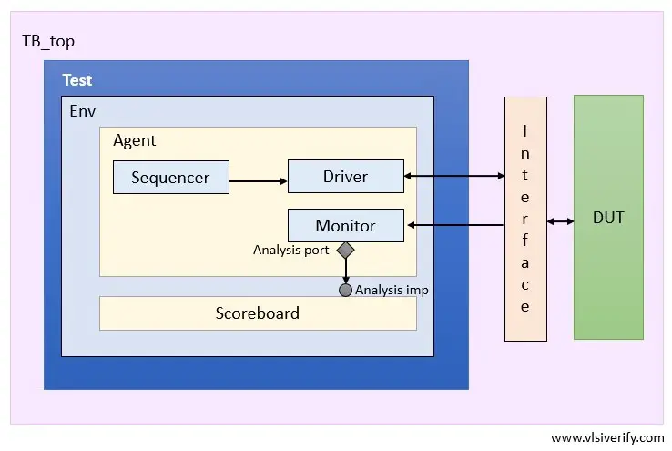

# AES ALGORITHM
ADVANCED ENCRYPTION STANDARD [128-BIT CTR MODE].

## Design
### OVERVIEW
The AES encryption process begins by receiving the plaintext and a 128-bit encryption key as inputs. To strengthen security, the algorithm first expands the original key into 10 unique round keys. The plaintext data is then arranged into a 4x4 “state matrix” (filled in column-wise), while the encryption key is arranged into its own 4x4 matrix (filled in row-wise).

The encryption consists of several transformation steps, each designed to protect your data:
1. Key Expansion – Generates all the round keys needed for each stage of encryption.

2. Add Round Key – Mixes the current data with a round key using bitwise operations.

3. Substitute Bytes – Applies a substitution table (S-box) to each byte for non-linearity.

4. Shift Rows – Shifts the rows of the state matrix to further scramble the data.

5. Mix Columns – Mixes the data within each column to enhance diffusion.

Each step is realized as an individual, synthesizable System Verilog module in this project. These modules are linked together and orchestrated by a Finite State Machine (FSM), ensuring data flows smoothly and securely through every stage of encryption, ultimately producing the final encrypted cipher.

### INPUTS AND OUTPUTS
For the Encryption device we have five inputs and three outputs as follows:
#### Inputs 
- Enable: A 1 bit signal received to enable the encryption operation.
- Reset: A 1 bit reset signal that forces Asynchronous reset.
- State_byte: 8 bits signal contains the cipher data received byte by byte every cycle.
- Key_byte: 8 bits signal contains the key received byte by byte every cycle.
Outputs 
- Load:  A 1 bit signal that indicates data is being received by the deivce.
- Ready: A 1 bit signal that indicates that the encryption process is finished and data is ready at the output.
- State_byte_out: 8 bits signal contains the encrypted data sent byte by byte every cycle.
### Sub Bytes
In this step, every byte in the state matrix is substituted with a new value from a special lookup table called the S-Box. This introduces confusion and helps make the encryption more secure.

### Key Expansion
The original 16-byte key provided by the user isn’t enough on its own—AES needs a new “round key” for each stage of encryption. The key expansion function cleverly combines the key, a set of round constants (rcon), and the S-Box to generate a unique key for every cycle of the process.

### Add Round Key
Here, the state matrix (which holds our data) is combined with the current round’s key matrix. This is done using a simple yet powerful bitwise XOR operation, ensuring the encryption is closely tied to the key.

### Shift Rows
To further scramble the data, each row of the state matrix is shifted to the left. The first row stays as is, the second row moves one position, the third row moves two, and the fourth row moves three positions. This helps spread the information across the matrix.

### Mix Columns
Finally, the columns of the state matrix are mixed together by multiplying them with a fixed “polynomial” matrix (denoted as P). This step blends the bytes in each column, making it even harder to break the encryption.

## Test Bench

### PROCESS
After instantiating the top module, a clock is generated and set as an input to the module, then we wait for 1 time unit, calling a reset function, after 5 time units it sets the reset signal to zero then trigger a reset done event. 

After the reset done event is triggered the enable signal is set, then the testing inputs – state and key – are sent to the module byte by byte every positive clock edge of the cycle.

After that we wait for a number of cycles then stop the test.
Using Questasim software we analyze the inputs and the outputs of every process’ step, and compare them with the expected values.

## UVM
### INTRODUCTION
After setting up the design by instantiating the top module, a clock signal is generated and fed into the module to drive its operations. We start by waiting briefly, then activate a reset sequence to make sure everything begins from a known state. After a short pause, the reset signal is deactivated and a “reset done” event is triggered—letting the system know it’s safe to move on.

Once the reset is complete, the enable signal is activated, and we begin feeding in our test inputs. The state (plaintext) and key values are sent into the module one byte at a time, precisely synchronized with each rising edge of the clock.

After supplying all the test inputs, we allow the design to run for several clock cycles to complete the encryption process, and then stop the test.

Throughout this process, we use Questasim software to closely monitor and analyze both the inputs and outputs at each stage. By comparing these results to the expected values, we can verify that each part of the AES encryption is performing correctly.

### PROCESS
The main DUT is instantiated inside the UVM tb top module and connected to the UVM’s interface. 

The driver then – Using a FSM - asks the sequencer to generate random inputs and it sends them to the DUT through the interface, then it waits for the ready signal after it finishes, the driver requests another random values. 

In the Monitor there are two class, one for the output and the other one for predicting it. The first one waits for the ready signal, and it then gets the output of the DUT using the interface and stores it in a transaction class object.

The other one get the input that goes to the DUT through the interface and it sends the inputs to the prediction class, and saves its output in a transaction class object.
In the scoreboard a compare function is called upon getting the outputs and it compares them, then display the test state – success or fail. 

### AES Sequencer
The sequencer plays the role of a conductor, managing the flow of data through the testbench. Here, a UVM transaction class is crafted to bundle together all the necessary input and output values, along with the enable and reset signals. These values are randomly generated each time a new sequence starts, keeping tests fresh and ensuring comprehensive verification coverage. The sequencer hands these transactions off to the driver whenever they are needed for testing.

### AES Driver
The driver is responsible for actually delivering the test vectors to the AES design, much like a courier. Internally, it uses a Finite State Machine (FSM) to stay organized:

First, it requests new values from the sequencer.

Next, it sends the state and key, byte by byte, into the DUT (Device Under Test).

Then, it waits patiently for the ready signal before moving on to gather the encrypted output.

When data has been sent and the output is ready, it cycles back to the beginning and starts the process again.

This systematic approach ensures that every scenario gets a thorough check.

### AES Monitor
The monitor is split into two parts, each with a specific role:

“Monitor Before” keeps an eye on the outputs from the DUT. Once the DUT indicates it’s ready, this monitor captures the encrypted data and neatly packages it in a transaction object. It then shares this data with the rest of the testbench using the analysis port.

“Monitor After” focuses on the input side, waiting for the enable signal to collect the test inputs. These inputs are sent to a prediction class, which calculates the expected outputs. These predicted results are also made available to the rest of the testbench for comparison.

This dual monitoring setup ensures that both the real and expected behaviors are checked closely.

### AES Scoreboard
The scoreboard pulls everything together. Acting as the “referee” of the testbench, it takes data from both monitors and compares the outputs of the DUT with the expected results from the prediction class. Using UVM’s reporting, it logs whether the AES design behaves as intended and highlights any discrepancies.

### Run.do File
The run.do file is your simulation script. It compiles all the SystemVerilog source files, links in the UVM files, and launches the simulation with the correct settings and test names. This automation ensures that simulations run consistently.
